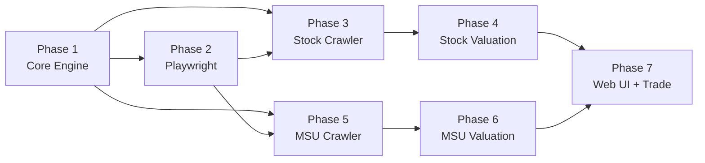

# Implementation Plan — Valuation Pricing Tools v1.0

> Tham chiếu: `project_structure.md` cho cấu trúc thư mục chi tiết.

---

## Tổng Quan Quyết Định

| Hạng mục | Quyết định |
|---|---|
| Kiến trúc | Rust Workspace: Core + Modules riêng biệt |
| API Key | Không có → reverse-engineer internal API + Playwright |
| Browser tool | Playwright (stealth + anti-detect mạnh) |
| WASM Runtime | Wasmtime (pre-compile, near-native speed) |
| Registry | DashMap (lock-free cache) + SQLite (persist) |
| Config | ArcSwap (hot-reload không restart) |
| Stock | 1 module, batch crawl, 20+ TA + Fundamental |
| NFT | MSU Game, stream realtime, Flipping Engine |
| Web UI | Trang đề xuất deals NFT + Stock dashboard |

---

## Phase 1: Core Engine Foundation

### Mục tiêu
Xây dựng toàn bộ **tính năng dùng chung** để các module plug vào.

### 1.1 Config Manager (`core/src/config/`)

**Files:** `mod.rs`, `dynamic.rs`

| Tính năng | Chi tiết |
|---|---|
| Load TOML | Đọc `config/core.toml` + `config/modules.toml` |
| ArcSwap | Hot-reload config runtime, lock-free read |
| Module toggle | Bật/tắt module + service qua API |

**Config mẫu — `config/core.toml`:**
```toml
[server]
host = "127.0.0.1"
port = 8080

[proxy.api_pool]
enabled = false
rotation = "round_robin"
health_check_secs = 60

[proxy.browser_pool]
enabled = false
rotation = "round_robin"

[playwright]
node_path = "node"
scripts_dir = "./playwright/scripts"
headless = true
stealth = true
```

**Config mẫu — `config/modules.toml`:**
```toml
[modules.stock_vn]
enabled = true

[modules.stock_vn.crawler]
enabled = true
mode = "batch"
schedule = "0 16 * * 1-5"
sources = ["simplize", "yahoo"]

[modules.stock_vn.valuation]
enabled = true
tech_weight = 0.4
fund_weight = 0.6

[modules.stock_vn.trade]
enabled = false

[modules.msu_game]
enabled = true

[modules.msu_game.crawler]
enabled = true
mode = "stream"
interval_secs = 10

[modules.msu_game.valuation]
enabled = true

[modules.msu_game.trade]
enabled = false
strategy = "browser_ui"
max_trade_per_hour = 5
min_deal_score = 40
```

### 1.2 Common Types (`core/src/common/`)

**Files:** `types.rs`, `errors.rs`, `utils.rs`

```rust
// types.rs — Dùng chung cho mọi module
pub enum Recommendation { StrongBuy, Buy, Hold, Sell, StrongSell }
pub enum TrendDirection { StrongBullish, Bullish, Neutral, Bearish, StrongBearish }
pub enum ConfidenceLevel { VeryHigh, High, Medium, Low, VeryLow }

pub struct ValuationResult {
    pub score: f64,           // 0-100
    pub recommendation: Recommendation,
    pub confidence: ConfidenceLevel,
    pub details: HashMap<String, f64>,
    pub notes: Vec<String>,
    pub timestamp: DateTime<Utc>,
}
```

### 1.3 HTTP Client + Proxy (`core/src/crawler/`, `core/src/proxy/`)

**Files:** `http_client.rs`, `proxy/mod.rs`

| Tính năng | Chi tiết |
|---|---|
| reqwest client | Giả lập User-Agent, Cookie, Referer |
| Proxy rotation | Round-robin qua danh sách proxy |
| Health check | Mark dead/alive, auto failover |
| 2 pools | API proxy (datacenter) + Browser proxy (residential) |
| Rate limit | Configurable delay giữa requests |
| Retry | Auto retry khi lỗi (3 lần) |

### 1.4 Playwright Wrapper (`core/src/crawler/playwright.rs`)

| Tính năng | Chi tiết |
|---|---|
| Subprocess | Spawn `node playwright/scripts/xxx.js` |
| Input/Output | JSON qua stdin/stdout pipe |
| Stealth | playwright-stealth plugin, random delays |
| Proxy | Truyền proxy URL vào Playwright launch options |
| Error handling | Parse stderr, timeout detection |

```rust
// Cách Core gọi Playwright:
pub async fn playwright_run(script: &str, params: Value) -> Result<Value> {
    // spawn: node playwright/scripts/{script}.js
    // stdin: JSON params (url, proxy, action...)
    // stdout: JSON result (data, error, screenshot_path)
}
```

**3 cách Playwright lấy data từ website:**

```javascript
// === Cách 1: BẮT API NỘI BỘ (TỐT NHẤT) ===
// Website khi load sẽ gọi internal API → ta lắng nghe response
const collectedData = [];
page.on('response', async (response) => {
    const url = response.url();
    // Simplize gọi API nội bộ khi load trang cổ phiếu
    if (url.includes('/api/company/') || url.includes('/api/stock/')) {
        const json = await response.json();
        collectedData.push({ url, data: json });
    }
});
await page.goto('https://simplize.vn/co-phieu/VNM');
await page.waitForTimeout(3000); // Đợi API calls xong
// collectedData giờ chứa JSON từ internal API!
console.log(JSON.stringify(collectedData)); // Push về Rust qua stdout

// === Cách 2: INJECT JS VÀO DOM ===
// Đọc dữ liệu từ HTML elements
const data = await page.evaluate(() => {
    return {
        price: document.querySelector('.price')?.textContent,
        change: document.querySelector('.change')?.textContent,
        pe: document.querySelector('[data-field="pe"]')?.textContent,
    };
});

// === Cách 3: INTERCEPT + MODIFY ===
// Chặn request, thêm header, đọc response
await page.route('**/api/**', async (route) => {
    const response = await route.fetch(); // Gọi thật
    const json = await response.json();
    // Lưu data, rồi continue
    capturedData.push(json);
    await route.fulfill({ response });
});
```

**Lưu session/cookie (không cần login lại mỗi lần):**
```javascript
// Lưu sau khi login thành công:
const cookies = await context.cookies();
fs.writeFileSync('playwright/sessions/simplize_session.json',
    JSON.stringify(cookies));

// Khôi phục khi khởi động lại:
const cookies = JSON.parse(
    fs.readFileSync('playwright/sessions/simplize_session.json'));
await context.addCookies(cookies);
// → Không cần login lại!
```

### 1.5 Module Registry (`core/src/registry/`)

| Tính năng | Chi tiết |
|---|---|
| DashMap cache | O(1) lookup module info by market_id |
| SQLite persist | Lưu registry vào core.db |
| Startup | Load tất cả modules từ DB → DashMap |
| Register | Thêm module mới → DashMap + DB |
| Toggle | Bật/tắt module/service → update DashMap |

### 1.6 Scheduler (`core/src/scheduler/`)

| Chế độ | Cách hoạt động | Dùng cho |
|---|---|---|
| **Batch** | Cron expression → trigger task | Cổ phiếu (16h hàng ngày) |
| **Stream** | Loop vô tận, sleep(interval) | NFT (mỗi 10-30 giây) |

```rust
// Scheduler spawn task cho module:
scheduler.register_batch("stock_vn", "0 16 * * 1-5", || {
    stock_vn::crawl();
    stock_vn::valuate();
});

scheduler.register_stream("msu_game", Duration::from_secs(10), || {
    msu_game::crawl();
    msu_game::valuate();
    if trade_enabled { msu_game::check_deals(); }
});
```

### 1.7 REST API Gateway (`core/src/api/`)

**Endpoints chung (Core):**

| Method | Path | Mô tả |
|---|---|---|
| `GET` | `/api/v1/health` | Health check |
| `GET` | `/api/v1/config` | Lấy config hiện tại |
| `PUT` | `/api/v1/config` | Cập nhật config (hot-reload) |
| `GET` | `/api/v1/modules` | Liệt kê modules + trạng thái |
| `PUT` | `/api/v1/modules/:id/toggle` | Bật/tắt module |
| `PUT` | `/api/v1/modules/:id/service/:svc` | Bật/tắt service (crawler/valuation/trade) |

**Endpoints riêng module (đăng ký bởi module):**

| Method | Path | Module | Mô tả |
|---|---|---|---|
| `POST` | `/api/v1/stock/crawl` | stock_vn | Trigger crawl thủ công |
| `POST` | `/api/v1/stock/valuate/:symbol` | stock_vn | Định giá 1 mã |
| `GET` | `/api/v1/stock/watchlist` | stock_vn | Danh sách mã theo dõi |
| `GET` | `/api/v1/stock/history/:symbol` | stock_vn | Lịch sử giá + valuation |
| `POST` | `/api/v1/msu/crawl` | msu_game | Trigger crawl thủ công |
| `GET` | `/api/v1/msu/deals` | msu_game | Danh sách deals hiện tại |
| `GET` | `/api/v1/msu/deals/history` | msu_game | Lịch sử deals đã mua/bán |
| `GET` | `/api/v1/msu/items` | msu_game | Danh sách items đang theo dõi |
| `POST` | `/api/v1/msu/trade/:item_id` | msu_game | Trigger mua item thủ công |

### 1.8 Storage Helpers (`core/src/storage/`)

| Tính năng | Chi tiết |
|---|---|
| Pool factory | Tạo SQLite connection pool cho mỗi module |
| Migration | Chạy migrations tự động khi khởi tạo |
| Core DB | core.db: module_registry, config_snapshots, **module_state** |

### 1.9 State Manager (`core/src/state/`) 🆕

**Mục đích:** Lưu trạng thái runtime → khi restart biết module nào đang chạy.

**Cơ chế:**
```
Khởi động hệ thống:
  1. Đọc config/modules.toml     → default config (bật/tắt gì)
  2. Đọc core.db:module_state   → trạng thái lần chạy cuối
  3. Merge: DB state override TOML default
  4. Khôi phục đúng trạng thái trước đó

Thay đổi từ Admin UI / API:
  1. User bật/tắt module qua Admin UI
  2. API cập nhật DashMap (runtime)
  3. Đồng thời ghi vào core.db:module_state (persist)
  4. Lần khởi động sau → load từ DB → đúng state
```

**DB Schema (core.db):**
```sql
CREATE TABLE module_state (
    module_id TEXT NOT NULL,        -- 'stock_vn', 'msu_game'
    service TEXT NOT NULL,          -- 'module', 'crawler', 'valuation', 'trade'
    enabled INTEGER DEFAULT 1,      -- 0/1
    status TEXT DEFAULT 'stopped',  -- 'running', 'stopped', 'error'
    last_run TEXT,                  -- ISO datetime
    error_count INTEGER DEFAULT 0,
    last_error TEXT,
    updated_at TEXT,
    PRIMARY KEY (module_id, service)
);

-- Ví dụ data:
-- ('stock_vn',  'module',    1, 'running', '2026-05-02T16:00:00')
-- ('stock_vn',  'crawler',   1, 'stopped', '2026-05-02T16:00:00')
-- ('stock_vn',  'valuation', 1, 'stopped', '2026-05-02T16:00:05')
-- ('stock_vn',  'trade',     0, 'stopped', NULL)
-- ('msu_game',  'module',    1, 'running', '2026-05-02T07:00:00')
-- ('msu_game',  'crawler',   1, 'running', '2026-05-02T07:06:40')
-- ('msu_game',  'valuation', 1, 'running', '2026-05-02T07:06:41')
-- ('msu_game',  'trade',     0, 'stopped', NULL)
```

### 1.10 Admin API Endpoints 🆕

| Method | Path | Mô tả |
|---|---|---|
| `GET` | `/api/v1/admin/status` | Trạng thái tất cả modules + services |
| `PUT` | `/api/v1/admin/modules/:id/toggle` | Bật/tắt module |
| `PUT` | `/api/v1/admin/modules/:id/:svc/toggle` | Bật/tắt service (crawler/valuation/trade) |
| `POST` | `/api/v1/admin/modules/:id/:svc/start` | Start service (trigger now) |
| `POST` | `/api/v1/admin/modules/:id/:svc/stop` | Stop service |
| `GET` | `/api/v1/admin/logs` | Xem logs gần nhất |
| `GET` | `/api/v1/admin/logs/:id` | Logs của module cụ thể |

---

## Phase 2: Playwright Setup

### Mục tiêu
Cài đặt Node.js + Playwright + stealth plugins.

### Files

```
playwright/
├── package.json
├── scripts/
│   ├── simplize_crawler.js     # Phase 3
│   ├── msu_crawler.js          # Phase 5
│   └── msu_trader.js           # Phase 7
└── stealth/
    └── config.js               # Anti-detect config
```

### Stealth Config
```javascript
// config.js
module.exports = {
    // Fake browser fingerprint
    userAgent: 'Mozilla/5.0 ... Chrome/120 ...',
    viewport: { width: 1920, height: 1080 },
    locale: 'vi-VN',
    timezone: 'Asia/Ho_Chi_Minh',
    // Random delays
    minDelay: 500,    // 500ms
    maxDelay: 2000,   // 2s
    // Stealth patches
    hideWebdriver: true,
    fakePermissions: true,
};
```

---

## Phase 3: Stock Crawler (modules/stock_vn/crawler/)

### Mục tiêu
Crawl dữ liệu cổ phiếu VN từ Simplize + Yahoo.

### 3.1 Simplize Crawler (`simplize.rs`)

**Bước 1: Reverse-engineer API**
- Mở Simplize.vn bằng browser → DevTools Network
- Bắt các XHR/Fetch requests trang gọi khi load data
- Replicate headers + params → gọi trực tiếp từ Rust

**Bước 2: Playwright fallback** (khi API bị chặn hoặc cần login)
- Script `simplize_crawler.js`:
  - Navigate → Login (nếu cần) → Crawl BCTC
  - Parse DOM → extract financial data
  - Return JSON qua stdout

**Dữ liệu output:**
```rust
pub struct SimplizeStockData {
    pub symbol: String,           // "VNM"
    pub price: f64,               // 60900.0
    pub change_pct: f64,          // -0.49
    pub volume: u64,              // 1234567
    pub market_cap: f64,          // 
    pub pe_ratio: Option<f64>,    // P/E
    pub pb_ratio: Option<f64>,    // P/B
    pub eps: Option<f64>,         // EPS
    pub dividend_yield: Option<f64>,
    pub roe: Option<f64>,
    pub de_ratio: Option<f64>,    // D/E
    // BCTC (cần login):
    pub revenue: Option<f64>,
    pub net_income: Option<f64>,
    pub free_cash_flow: Option<f64>,
}
```

### 3.2 Yahoo Crawler (`yahoo.rs`)

**Trực tiếp HTTP GET (không cần Playwright):**
```
GET https://query1.finance.yahoo.com/v8/finance/chart/VNM.VN
    ?range=1y&interval=1d
Headers: User-Agent, Accept
→ JSON response: OHLCV array
```

**Dữ liệu output:**
```rust
pub struct OhlcvBar {
    pub date: NaiveDate,
    pub open: f64,
    pub high: f64,
    pub low: f64,
    pub close: f64,
    pub volume: u64,
}
```

### 3.3 Stock Scanner — Quét TOÀN BỘ mã VN 🆕 (`scanner.rs`)

**Mục tiêu:** Crawl danh sách tất cả cổ phiếu trên HOSE/HNX/UPCOM từ Simplize,
lấy thông số cơ bản → phục vụ screener lọc cổ phiếu giá trị.

**Cách hoạt động:**
```
1. Playwright mở Simplize → bắt API nội bộ lấy danh sách toàn bộ mã
   (Simplize có trang danh sách ~1700 mã VN)

2. Với mỗi mã, lấy:
   - Giá hiện tại, % thay đổi
   - Vốn hóa thị trường
   - P/E, P/B
   - EPS, EPS growth (YoY)
   - Dividend Yield (tỷ suất cổ tức)
   - Lịch sử trả cổ tức (3-5 năm gần nhất)
   - ROE, D/E
   - Revenue growth

3. Batch crawl: chia thành nhóm 50 mã/batch, delay 2-5s giữa batches
   → Tránh rate limit, dùng proxy rotation

4. Lưu vào stock_vn.db → tables: stock_universe, dividend_history

5. Schedule: 1 lần/tuần (cuối tuần) hoặc trigger thủ công
```

**Dữ liệu cần crawl cho mỗi mã:**
```rust
pub struct StockScanResult {
    pub symbol: String,           // "VNM"
    pub name: String,             // "CTCP Sữa Việt Nam"
    pub exchange: String,         // "HOSE" | "HNX" | "UPCOM"
    pub sector: String,           // "Thực phẩm & Đồ uống"
    pub price: f64,               // Giá hiện tại
    pub market_cap: f64,          // Vốn hóa (tỷ VND)
    pub pe_ratio: f64,            // P/E
    pub pb_ratio: f64,            // P/B — giá trị tài sản thực
    pub eps: f64,                 // Thu nhập trên cổ phiếu
    pub eps_growth: f64,          // % tăng trưởng EPS YoY
    pub dividend_yield: f64,      // Tỷ suất cổ tức hiện tại
    pub dividend_years: u32,      // Số năm trả cổ tức liên tục
    pub avg_dividend_growth: f64, // % tăng trưởng cổ tức trung bình
    pub roe: f64,                 // ROE (hiệu quả vốn)
    pub de_ratio: f64,            // D/E (đòn bẩy tài chính)
    pub revenue_growth: f64,      // % tăng trưởng doanh thu YoY
    pub book_value_per_share: f64,// Giá trị sổ sách / cổ phiếu
    // 🆕 Bổ sung:
    pub total_assets: f64,        // Tổng tài sản (tỷ VND)
    pub total_liabilities: f64,   // Tổng nợ (tỷ VND)
    pub equity: f64,              // Vốn chủ sở hữu = assets - liabilities
    pub net_income_q: f64,        // Lợi nhuận ròng quý gần nhất
    pub net_income_q_prev: f64,   // Lợi nhuận ròng quý trước
    pub net_income_growth_qoq: f64, // % tăng trưởng LN quý/quý
    pub net_income_y: f64,        // Lợi nhuận ròng năm gần nhất
    pub net_income_growth_yoy: f64, // % tăng trưởng LN năm/năm
    pub consecutive_profit_quarters: u32, // Số quý có lãi liên tiếp
}
```

### 3.4 DB Schema (stock_vn.db) — Bổ sung Scanner

```sql
-- Lịch sử giá OHLCV
CREATE TABLE price_history (
    id INTEGER PRIMARY KEY,
    symbol TEXT NOT NULL,
    date TEXT NOT NULL,
    open REAL, high REAL, low REAL, close REAL,
    volume INTEGER,
    source TEXT DEFAULT 'yahoo',
    UNIQUE(symbol, date)
);

-- Dữ liệu fundamental
CREATE TABLE fundamental_data (
    id INTEGER PRIMARY KEY,
    symbol TEXT NOT NULL,
    date TEXT NOT NULL,
    pe_ratio REAL, pb_ratio REAL, eps REAL,
    dividend_yield REAL, roe REAL, de_ratio REAL,
    revenue REAL, net_income REAL, free_cash_flow REAL,
    market_cap REAL,
    source TEXT DEFAULT 'simplize',
    UNIQUE(symbol, date)
);

-- Kết quả valuation
CREATE TABLE valuation_results (
    id INTEGER PRIMARY KEY,
    symbol TEXT NOT NULL,
    timestamp TEXT NOT NULL,
    tech_score REAL,
    fund_score REAL,
    final_score REAL,
    recommendation TEXT,
    details_json TEXT
);

-- Danh sách theo dõi
CREATE TABLE watchlist (
    symbol TEXT PRIMARY KEY,
    name TEXT,
    added_at TEXT
);

-- 🆕 Toàn bộ mã cổ phiếu VN (scanner)
CREATE TABLE stock_universe (
    symbol TEXT PRIMARY KEY,
    name TEXT NOT NULL,
    exchange TEXT,              -- HOSE, HNX, UPCOM
    sector TEXT,                -- Ngành
    price REAL,
    market_cap REAL,           -- Vốn hóa (tỷ VND)
    pe_ratio REAL,
    pb_ratio REAL,             -- ← Giá trị tài sản thực
    eps REAL,
    eps_growth REAL,           -- % tăng trưởng EPS
    dividend_yield REAL,       -- Tỷ suất cổ tức
    roe REAL,
    de_ratio REAL,
    revenue_growth REAL,
    book_value_per_share REAL, -- Giá trị sổ sách / CP
    -- 🆕 Bổ sung:
    total_assets REAL,         -- Tổng tài sản (tỷ VND)
    total_liabilities REAL,    -- Tổng nợ (tỷ VND)
    equity REAL,               -- Vốn chủ sở hữu
    net_income_q REAL,         -- LN ròng quý gần nhất
    net_income_growth_qoq REAL,-- % tăng LN quý/quý
    net_income_y REAL,         -- LN ròng năm gần nhất
    net_income_growth_yoy REAL,-- % tăng LN năm/năm
    consecutive_profit_q INTEGER, -- Số quý có lãi liên tiếp
    last_scan TEXT             -- Lần scan cuối
);

-- 🆕 Lịch sử trả cổ tức (3-5 năm)
CREATE TABLE dividend_history (
    id INTEGER PRIMARY KEY,
    symbol TEXT NOT NULL,
    year INTEGER NOT NULL,
    dividend_per_share REAL,   -- VND / cổ phiếu
    dividend_yield REAL,       -- %
    ex_date TEXT,              -- Ngày giao dịch không hưởng quyền
    payment_date TEXT,
    UNIQUE(symbol, year)
);

-- 🆕 Kết quả screener (lọc cổ phiếu giá trị)
CREATE TABLE screener_results (
    id INTEGER PRIMARY KEY,
    symbol TEXT NOT NULL,
    scan_date TEXT NOT NULL,
    value_score REAL,          -- Điểm giá trị tổng hợp (0-100)
    dividend_score REAL,       -- Điểm cổ tức (0-100)
    growth_score REAL,         -- Điểm tăng trưởng (0-100)
    safety_score REAL,         -- Điểm an toàn tài chính (0-100)
    rank INTEGER,              -- Xếp hạng trong toàn bộ
    reason TEXT,               -- Lý do đề xuất
    UNIQUE(symbol, scan_date)
);
```

---

## Phase 4: Stock Valuation (modules/stock_vn/valuation/)

### Mục tiêu
Implement full 20+ Technical indicators + Fundamental Analysis + **Value Screener**.

### Phase 4.5: Value Screener — Lọc Cổ Phiếu Giá Trị Đầu Tư Dài Hạn 🆕

**Input:** Toàn bộ ~1700 mã VN từ `stock_universe` table
**Output:** Top N cổ phiếu đáng đầu tư dài hạn + điểm chi tiết

#### Tiêu chí lọc (configurable):

| # | Tiêu chí | Ngưỡng mặc định | Ý nghĩa | Trọng số |
|:---:|---|---|---|:---:|
| 1 | **P/B < threshold** | P/B < 1.5 | Giá thấp hơn giá trị tài sản thực | 15% |
| 2 | **Cổ tức ổn định** | Trả ≥3 năm liên tục | Công ty tạo ra lợi nhuận thật | 15% |
| 3 | **Dividend Yield** | > 5% (> lãi suất ngân hàng) | Thu nhập thụ động tốt | 10% |
| 4 | **EPS Growth** | > 5% YoY | Lợi nhuận đang tăng | 10% |
| 5 | **D/E ratio** | < 1.5 | Ít nợ, an toàn tài chính | 8% |
| 6 | **ROE** | > 12% | Sử dụng vốn hiệu quả | 7% |
| 7 | **Revenue Growth** | > 0% | Doanh thu không suy giảm | 5% |
| 8 | **Market Cap** | > 1000 tỷ VND | Đủ lớn, thanh khoản tốt | 5% |
| 9 | **🆕 Tài sản > Nợ** | Tổng tài sản > Tổng nợ | DN có cơ sở tài sản vững | 10% |
| 10 | **🆕 LN quý tăng** | Net Income QoQ > 0% | Lợi nhuận quý đang tăng | 8% |
| 11 | **🆕 LN năm tăng** | Net Income YoY > 0% | Lợi nhuận năm đang tăng | 7% |

#### Cách tính Value Score:

```
Value_Score = Σ(criterion_score × weight)

Mỗi criterion normalize 0-100:
  P/B:
    ≤ 0.8 → 100 (cực tốt, dưới giá trị sổ sách)
    ≤ 1.0 → 85
    ≤ 1.5 → 60
    ≤ 2.0 → 40
    > 2.0 → 20

  Dividend Yield:
    ≥ 10% → 100
    ≥ 7%  → 85
    ≥ 5%  → 70 (tốt hơn gửi bank)
    ≥ 3%  → 50
    < 3%  → 20

  Cổ tức ổn định:
    ≥ 5 năm liên tục → 100
    ≥ 3 năm → 70
    ≥ 1 năm → 40
    0 năm → 0

  EPS Growth:
    ≥ 20% → 100
    ≥ 10% → 80
    ≥ 5%  → 60
    > 0%  → 40
    ≤ 0%  → 10 (lợi nhuận giảm)

  🆕 Tài sản vs Nợ (Asset Coverage Ratio = Assets / Liabilities):
    ≥ 3.0 → 100 (tài sản gấp 3 lần nợ, cực an toàn)
    ≥ 2.0 → 85
    ≥ 1.5 → 70
    ≥ 1.0 → 40  (tài sản = nợ, rủi ro)
    < 1.0 → 0   (nợ > tài sản, nguy hiểm!)

  🆕 LN quý tăng trưởng (QoQ):
    ≥ 30% → 100 (tăng đột phá)
    ≥ 15% → 80
    ≥ 5%  → 60
    > 0%  → 40  (có lãi, tăng nhẹ)
    ≤ 0%  → 10  (LN quý giảm)

  🆕 LN năm tăng trưởng (YoY):
    ≥ 25% → 100
    ≥ 15% → 80
    ≥ 5%  → 60
    > 0%  → 40
    ≤ 0%  → 10  (LN năm giảm)
```

#### Tính lợi nhuận kỳ vọng:

```
Lợi nhuận kỳ vọng hàng năm = Dividend_Yield + Avg_Price_Growth

Ví dụ:
  VNM: Dividend Yield 5% + Price Growth 3% = ~8%/năm
  FPT: Dividend Yield 2% + Price Growth 15% = ~17%/năm

So sánh với:
  Gửi ngân hàng: ~5-6%/năm
  → Nếu kỳ vọng > 8% → Cổ phiếu hấp dẫn hơn
```

#### Scanner API Endpoints 🆕:

| Method | Path | Mô tả |
|---|---|---|
| `POST` | `/api/v1/stock/scan` | Trigger quét toàn bộ mã VN |
| `GET` | `/api/v1/stock/scan/status` | Trạng thái scan hiện tại |
| `GET` | `/api/v1/stock/screener` | Top cổ phiếu giá trị (sorted by score) |
| `GET` | `/api/v1/stock/screener?pb_max=1.5&div_min=5` | Lọc theo tiêu chí custom |
| `GET` | `/api/v1/stock/universe` | Toàn bộ mã VN + thông số |
| `GET` | `/api/v1/stock/:symbol/dividend` | Lịch sử cổ tức 1 mã |

### 4.1 Technical Analysis (`technical.rs`)

**Input:** Vec<OhlcvBar> (365 ngày)
**Output:** TechnicalScore (0-100) + chi tiết từng indicator

**20+ Indicators phân nhóm:**

| # | Nhóm | Indicator | Trọng số | Tín hiệu |
|:---:|---|---|:---:|---|
| 1 | Trend | SMA (10,20,50,200) | 8% | Giá > SMA = bullish |
| 2 | Trend | EMA (12,26) | 8% | EMA12 > EMA26 = bullish |
| 3 | Trend | MACD (12,26,9) | 10% | MACD > Signal = buy |
| 4 | Trend | ADX (14) | 5% | >25 = trend mạnh |
| 5 | Trend | Ichimoku | 5% | Giá > Cloud = bullish |
| 6 | Oscillator | RSI (14) | 10% | >70 overbought, <30 oversold |
| 7 | Oscillator | Stochastic (14,3) | 5% | >80 overbought, <20 oversold |
| 8 | Oscillator | CCI (20) | 3% | >100 overbought |
| 9 | Oscillator | Williams %R | 3% | >-20 overbought |
| 10 | Volatility | Bollinger (20,2) | 8% | Chạm band dưới = mua |
| 11 | Volatility | ATR (14) | 3% | Đo mức biến động |
| 12 | Volatility | HistVol (30d) | 3% | So sánh volatility |
| 13 | Volume | OBV | 5% | Confirm xu hướng |
| 14 | Volume | VWAP | 5% | Giá > VWAP = bullish |
| 15 | Volume | Volume Change | 5% | Đột biến volume |
| 16 | Volume | MFI (14) | 3% | RSI có volume |
| 17 | Signal | Golden/Death Cross | 5% | SMA50 vs SMA200 |
| 18 | Signal | Price ROC (10) | 3% | Tốc độ thay đổi |
| 19 | Signal | Parabolic SAR | 3% | Trailing stop |
| — | **Tổng** | | **100%** | |

### 4.2 Fundamental Analysis (`fundamental.rs`)

**Input:** FundamentalData (P/E, EPS, D/E, ROE, FCF...)
**Output:** FundamentalScore (0-100) + DCF + Recommendation

| Nhóm | Chỉ số | Trọng số |
|---|---|:---:|
| Định giá | P/E, P/B, PEG, EV/EBITDA | 33% |
| Tăng trưởng | EPS Growth, Revenue Growth | 20% |
| Sức khỏe | D/E, ROE, Current Ratio | 20% |
| Thu nhập | Dividend Yield, Payout Ratio | 12% |
| DCF | Intrinsic Value, Margin of Safety | 15% |

### 4.3 Recommendation Engine (`recommendation.rs`)

```
Final_Score = 0.4 × Technical_Score + 0.6 × Fundamental_Score

≥ 80 → StrongBuy
≥ 65 → Buy
≥ 45 → Hold
≥ 30 → Sell
< 30 → StrongSell
```

---

## Phase 5: MSU Crawler (modules/msu_game/crawler/)

### Mục tiêu
Crawl MSU marketplace items + giá + sales liên tục (streaming).

### 5.1 Reverse-engineer MSU API

**Bước 1:** Dùng Playwright mở msu.io/marketplace → DevTools Network → bắt API calls
**Bước 2:** Replicate calls bằng reqwest

**Expected API calls:**
```
GET https://msu.io/api/marketplace/nft?page=1&size=50&sort=price_asc
Headers: Cookie, User-Agent, X-CSRF-Token (nếu có)
→ JSON: { items: [...], total: 1234 }

GET https://msu.io/api/marketplace/recent-sales?limit=50
→ JSON: { sales: [...] }
```

### 5.2 Streaming Loop

```rust
// Chạy liên tục, mỗi 10 giây:
loop {
    let items = crawl_marketplace_listings().await?;
    let sales = crawl_recent_sales().await?;
    
    save_to_db(&items, &sales).await?;
    
    if valuation_enabled {
        let deals = find_deals(&items, &sales).await?;
        if !deals.is_empty() {
            notify_deals(&deals).await?; // API push / log
        }
    }
    
    tokio::time::sleep(Duration::from_secs(10)).await;
}
```

### 5.3 DB Schema (msu.db)

```sql
-- Items đang listing
CREATE TABLE nft_items (
    token_id TEXT PRIMARY KEY,
    name TEXT, category TEXT,
    price_neso REAL, price_nxpc REAL,
    rarity_rank INTEGER, total_supply INTEGER,
    stats_json TEXT,
    listed_at TEXT, seller_wallet TEXT,
    last_seen TEXT
);

-- Lịch sử bán
CREATE TABLE sales_history (
    id INTEGER PRIMARY KEY,
    token_id TEXT, name TEXT, category TEXT,
    price_neso REAL,
    sold_at TEXT,
    buyer_wallet TEXT, seller_wallet TEXT
);

-- Deals tìm được
CREATE TABLE deals (
    id INTEGER PRIMARY KEY,
    token_id TEXT, name TEXT,
    listing_price REAL,
    estimated_value REAL,
    deal_score REAL,
    status TEXT DEFAULT 'found',  -- found/bought/sold/expired
    found_at TEXT,
    bought_at TEXT, sold_at TEXT,
    profit REAL
);

-- Portfolio (items đang hold)
CREATE TABLE portfolio (
    token_id TEXT PRIMARY KEY,
    name TEXT, category TEXT,
    buy_price REAL, buy_date TEXT,
    current_price REAL,
    unrealized_pnl REAL
);
```

---

## Phase 6: MSU Valuation + Flipping + Anti-Pump (modules/msu_game/valuation/)

### 6.1 Hệ Thống Định Giá NFT — Toàn Diện

**Tầng 1: Giá trị nội tại (Intrinsic Value) — dựa trên thuộc tính game**

#### A. Cấp độ & Enhancement (20%)

| Yếu tố | Cách tính | Ý nghĩa |
|---|---|---|
| **Star Force Level** | Chi phí nâng cấp tích lũy (NESO spent) | Giá sàn tối thiểu = tổng chi phí nâng cấp |
| **Enhancement Success Rate** | Star càng cao → tỷ lệ thành công càng thấp | Star cao = may mắn + tốn kém |
| **Level của item** | Level 1 vs Level 200+ | Level cao = đã đầu tư thời gian |

```
Enhancement_Value = Σ(cost_per_star × (1 / success_rate))
  VD: Star 10 → cost ~50K NESO, rate 50% → expected cost = 100K
      Star 15 → cost ~200K NESO, rate 30% → expected cost = 667K
      Tổng expected cost 0→15 stars = ~2M NESO
```

#### B. Độ hiếm / Rarity (25%)

| Yếu tố | Cách tính | Ý nghĩa |
|---|---|---|
| **Rarity Tier** | Common < Rare < Epic < Unique < Legendary | Tier quyết định sức mạnh cơ bản |
| **Trait Rarity** | 1 / (% xuất hiện trait) | Trait xuất hiện 1% → score = 100 |
| **Supply** | Tổng số item loại này tồn tại | Supply thấp = hiếm hơn |
| **Potential Tier** | Rare / Epic / Unique / Legendary potential lines | Potential cao = roll tốt, cực hiếm |

```
Rarity_Score = (Tier_Score × 0.3) + (Trait_Score × 0.3) 
             + (Supply_Score × 0.2) + (Potential_Score × 0.2)

Tier_Score normalize:
  Common    → 10
  Rare      → 30
  Epic      → 55
  Unique    → 80
  Legendary → 100

Supply_Score = max(0, 100 - (supply_count / 10))
  10 items tồn tại → 100-1 = 99 (cực hiếm)
  500 items → 100-50 = 50
  2000+ items → ~0 (rất phổ biến)
```

#### C. Chỉ số / Stats (20%)

| Yếu tố | Cách tính | Ý nghĩa |
|---|---|---|
| **Base Stats** | ATK, DEF, HP, MP, INT, LUK, DEX, STR | Stats cơ bản item |
| **Total Stats** | Tổng tất cả stats | So sánh với max possible |
| **Stats Percentile** | Vị trí trong phân phối | Top 10% stats = premium |

```
Stats_Score = (Total_Stats / Max_Possible_Stats) × 100

Hoặc dùng percentile:
  Top 1%  → 100
  Top 5%  → 90
  Top 10% → 80
  Top 25% → 60
  Top 50% → 40
  Dưới 50% → 20
```

#### D. Thuộc tính đặc biệt / Attributes (15%)

| Yếu tố | Cách tính | Ý nghĩa |
|---|---|---|
| **Potential Lines** | Số dòng potential tốt (Boss Damage, IED...) | Lines tốt = giá trị cao |
| **Set Bonus** | Thuộc set bộ nào | Set phổ biến = dễ bán |
| **Class Restriction** | Item dùng cho class nào | Class phổ biến = demand cao |
| **Soul/Flame** | Có soul/flame bonus không | Bonus thêm stats |
| **Collection Score** | Điểm khi đăng ký vào NFT Collection | Score cao = giá trị staking |

```
Attribute_Score = Σ(attribute_value × attribute_weight)

Potential Lines (rất quan trọng cho gameplay):
  3 lines Legendary → 100
  3 lines Unique    → 75
  3 lines Epic      → 50
  3 lines Rare      → 25
  No potential       → 0
```

#### E. Yếu tố thị trường (20%)

| Yếu tố | Cách tính | Ý nghĩa |
|---|---|---|
| **Floor Price** | Giá thấp nhất đang listing cùng category | Benchmark tối thiểu |
| **Avg Sale Price** | Trung bình 10-20 giao dịch gần nhất cùng loại | Giá thị trường thực |
| **Median Sale** | Trung vị giá bán (ít bị ảnh hưởng outlier) | Chống bơm giá |
| **Volume 7d** | Số lượng giao dịch 7 ngày | Demand thực sự |
| **Price Trend** | Giá trung bình 7d / 30d | Xu hướng tăng/giảm |
| **Listing Count** | Số item cùng loại đang bán | Supply hiện tại |

```
Market_Value = weighted_average(
    floor_price × 0.15,
    avg_sale_price × 0.30,
    median_sale × 0.30,
    trend_adjusted_price × 0.25
)
```

---

### 6.2 Tổng Hợp Định Giá — NFT Value Score

```
Estimated_Value = f(Enhancement, Rarity, Stats, Attributes, Market)

NFT_Score = (Enhancement_Score × 0.20) 
          + (Rarity_Score     × 0.25) 
          + (Stats_Score      × 0.20) 
          + (Attribute_Score  × 0.15)
          + (Market_Score     × 0.20)

NFT_Score → normalize 0-100

Kết hợp với giá listing:
  Deal_Score = (Estimated_Value - Listing_Price) / Estimated_Value × 100%
```

---

### 6.3 🆕 Thuật Toán Chống Bơm Giá (Anti-Pump Detection)

**Mục tiêu:** Phát hiện giá bị thao túng, tránh mua phải item bơm giá ảo.

#### Detector 1: Price Spike Detection (Phát hiện giá tăng đột biến)

```
Với mỗi item/category, tính:
  avg_price_30d = trung bình giá 30 ngày
  std_dev_30d   = độ lệch chuẩn giá 30 ngày

  Nếu giá hiện tại > avg_price_30d + (3 × std_dev_30d):
    → 🚩 CẢNH BÁO: Giá ngoài 3 sigma = bất thường thống kê
    → Confidence: 
        > 3σ = "Possible Pump" (60%)
        > 4σ = "Likely Pump" (80%)
        > 5σ = "Almost Certain Pump" (95%)
```

#### Detector 2: Wash Trading Detection (Giao dịch rửa)

```
Kiểm tra VÒNG LẶP giao dịch:
  1. Item A: Wallet_X bán → Wallet_Y mua
  2. Item A: Wallet_Y bán → Wallet_X mua (hoặc Wallet_Z liên quan)
  3. Giá mỗi lần bán tăng dần

  Nếu phát hiện:
    - Cùng item quay lại cùng wallet trong < 7 ngày
    - Hoặc nhóm 2-5 wallets trade qua lại > 3 lần
    → 🚩 WASH TRADING DETECTED
    → Loại bỏ các giao dịch này khỏi tính giá trung bình
```

```rust
// Kiểm tra wash trading
pub fn detect_wash_trading(sales: &[Sale]) -> Vec<WashTradeAlert> {
    let mut alerts = vec![];
    
    // Xây graph: wallet → wallet
    // Tìm strongly connected components (vòng lặp)
    // Nếu item quay lại wallet cũ trong < 7 ngày → flag
    
    for sale in sales {
        let prev_sales = find_previous_sales(sale.token_id);
        for prev in prev_sales {
            if prev.buyer_wallet == sale.seller_wallet 
               && days_between(prev.date, sale.date) < 7 {
                alerts.push(WashTradeAlert {
                    token_id: sale.token_id,
                    wallets: vec![prev.seller_wallet, sale.seller_wallet],
                    price_increase: sale.price - prev.price,
                    confidence: 0.85,
                });
            }
        }
    }
    alerts
}
```

#### Detector 3: Volume Anomaly (Khối lượng bất thường)

```
Tính volume trung bình 30 ngày cho category:
  avg_volume_30d = trung bình số giao dịch / ngày
  
  Nếu volume hôm nay > avg_volume_30d × 5:
    VÀ giá tăng > 50% so với hôm qua:
    VÀ tập trung ở 1-3 wallets:
    → 🚩 PUMP AND DUMP WARNING
```

#### Detector 4: Price Reversion Check (Giá quay đầu)

```
Sau khi phát hiện spike:
  Theo dõi giá 24-72h tiếp theo
  
  Nếu giá giảm > 30% sau spike:
    → Xác nhận: đó là PUMP AND DUMP
    → Đánh dấu wallets liên quan vào blacklist
    → Loại các giao dịch đó khỏi lịch sử tính giá
```

#### Detector 5: Wallet Clustering (Nhóm wallet liên quan)

```
Phân tích hành vi wallet:
  1. Wallet mới tạo < 7 ngày + trade volume cao → nghi ngờ
  2. Nhiều wallet cùng pattern (mua/bán cùng thời điểm) → nhóm bot
  3. Wallet chỉ trade 1 loại item duy nhất → nghi ngờ thao túng

Benford's Law Check:
  Phân tích phân phối chữ số đầu tiên của giá giao dịch
  Nếu lệch khỏi Benford distribution → giá nhân tạo
```

---

### 6.4 Safe Price Calculation (Giá An Toàn)

```
Khi tính Estimated_Value cho 1 item:

1. Lấy tất cả sales_history cùng category + stats tương tự
2. Chạy Anti-Pump Detectors:
   - Loại bỏ giao dịch wash trading
   - Loại bỏ giao dịch price spike > 3σ
   - Loại bỏ giao dịch từ wallet blacklist
3. Dùng MEDIAN (không phải MEAN) của remaining sales
   → Median ít bị ảnh hưởng bởi outlier hơn mean
4. Kết quả: Safe_Estimated_Value

Confidence Level:
  Nếu > 20 giao dịch clean → HighConfidence
  Nếu 10-20 → MediumConfidence
  Nếu 5-10 → LowConfidence
  Nếu < 5 → VeryLow (không đủ data, cẩn thận!)
```

---

### 6.5 Deal Finder — Cập nhật với Anti-Pump

```
Deal_Score = (Safe_Estimated_Value - Listing_Price) / Safe_Estimated_Value × 100%

TRƯỚC khi đề xuất deal, kiểm tra:
  ✅ Anti-pump check passed (không phải giá bơm)
  ✅ Confidence ≥ Medium (đủ dữ liệu lịch sử)
  ✅ Seller wallet KHÔNG trong blacklist
  ✅ Item không có wash trading history

Thresholds (config):
  ≥ 40% + HighConfidence → 🔥 CỰC TỐT → Auto buy (nếu trade=ON)
  ≥ 40% + MediumConfidence → ⭐ TỐT → Alert (review thủ công)
  ≥ 20% + HighConfidence → ✅ KHÁ → Theo dõi
  ≥ 20% + LowConfidence → ⚠️ CẨN THẬN → Có thể giá bị thao túng
  < 20% → GIÁ HỢP LÝ
```

---

### 6.6 DB Schema Bổ Sung (msu.db)

```sql
-- 🆕 Lịch sử giá theo category (cho anti-pump)
CREATE TABLE price_history_category (
    id INTEGER PRIMARY KEY,
    category TEXT NOT NULL,
    date TEXT NOT NULL,
    avg_price REAL,
    median_price REAL,
    min_price REAL,
    max_price REAL,
    volume INTEGER,         -- Số giao dịch
    std_dev REAL,           -- Độ lệch chuẩn
    UNIQUE(category, date)
);

-- 🆕 Cảnh báo bơm giá
CREATE TABLE pump_alerts (
    id INTEGER PRIMARY KEY,
    alert_type TEXT,         -- 'price_spike', 'wash_trade', 'volume_anomaly'
    category TEXT,
    token_id TEXT,
    description TEXT,
    confidence REAL,         -- 0.0 - 1.0
    involved_wallets TEXT,   -- JSON array of wallet addresses
    detected_at TEXT,
    resolved INTEGER DEFAULT 0  -- Đã xác nhận / bác bỏ
);

-- 🆕 Wallet blacklist (nghi ngờ thao túng)
CREATE TABLE wallet_blacklist (
    wallet TEXT PRIMARY KEY,
    reason TEXT,             -- 'wash_trading', 'pump_dump', 'bot_cluster'
    flagged_at TEXT,
    alert_count INTEGER DEFAULT 1
);
```

---

### 6.7 🆕 Configurable Weights — Tùy Chỉnh Trọng Số

**Mục tiêu:** Mỗi game/category có đặc thù riêng → user tùy chỉnh weight cho phù hợp.

**Config trong `modules.toml`:**
```toml
[modules.msu_game.valuation.weights]
# Trọng số mặc định (tổng = 1.0)
enhancement = 0.20    # Cấp độ & Star Force
rarity      = 0.25    # Độ hiếm
stats       = 0.20    # Chỉ số ATK/DEF/HP...
attributes  = 0.15    # Thuộc tính đặc biệt
market      = 0.20    # Yếu tố thị trường

# Tùy chỉnh theo CATEGORY (override mặc định):
[modules.msu_game.valuation.weights.overrides.weapon]
# Vũ khí → stats quan trọng hơn, cosmetic ít quan trọng
stats       = 0.30    # Vũ khí = stats là vua
enhancement = 0.25
rarity      = 0.20
attributes  = 0.10
market      = 0.15

[modules.msu_game.valuation.weights.overrides.cosmetic]
# Trang phục → rarity + attributes quan trọng hơn
rarity      = 0.35    # Trang phục hiếm = giá trị
attributes  = 0.25    # Cosmetic effect
stats       = 0.05    # Stats ít quan trọng
enhancement = 0.10
market      = 0.25

[modules.msu_game.valuation.weights.overrides.character]
# Nhân vật → tổng hợp, level + stats quan trọng
enhancement = 0.30    # Level nhân vật
stats       = 0.25
rarity      = 0.15
attributes  = 0.15
market      = 0.15
```

**API để chỉnh weight realtime:**
| Method | Path | Mô tả |
|---|---|---|
| `GET` | `/api/v1/msu/config/weights` | Lấy trọng số hiện tại |
| `PUT` | `/api/v1/msu/config/weights` | Cập nhật trọng số (hot-reload) |
| `PUT` | `/api/v1/msu/config/weights/:category` | Override cho category cụ thể |
| `DELETE` | `/api/v1/msu/config/weights/:category` | Xóa override → dùng mặc định |

---

### 6.8 🆕 Tiêu Chí Bổ Sung — Yếu Tố Khác Ảnh Hưởng Giá

| # | Tiêu chí | Mô tả | Có thể tự động? |
|:---:|---|---|:---:|
| 1 | **Seasonal/Event** | Item chỉ có trong event đặc biệt, không còn drop nữa | ⚠️ Bán tự động |
| 2 | **Meta Value** | Item đang "meta" (best-in-slot cho patch hiện tại) | ❌ Cần human input |
| 3 | **Cosmetic/Aesthetic** | Item trông đẹp, effect cool (skin, vfx) | ❌ Cần human input |
| 4 | **Age/Vintage** | Item cũ không còn obtainable → hiếm dần | ✅ Tự động (check drop table) |
| 5 | **Set Completion** | Item là piece cuối cùng để hoàn set → premium | ✅ Tự động |
| 6 | **Patch Impact** | Patch mới buff/nerf class → ảnh hưởng giá vũ khí class đó | ⚠️ Bán tự động |

→ **Meta, Cosmetic** = yếu tố **con người** phải đánh giá → cần **Manual Valuation**.

---

### 6.9 🆕 Manual Valuation + Hybrid Scoring

#### Ai làm gì?

```
┌──────────────────────────────────────────────────┐
│                                                  │
│  THUẬT TOÁN (Auto)          CON NGƯỜI (Manual)   │
│  ──────────────             ──────────────────   │
│  ✅ Enhancement cost        ✅ Meta value         │
│  ✅ Rarity scoring          ✅ Cosmetic appeal    │
│  ✅ Stats comparison        ✅ Event rarity       │
│  ✅ Market price (median)   ✅ Kinh nghiệm game  │
│  ✅ Anti-pump detection     ✅ Trend dự đoán      │
│  ✅ Wallet analysis         ✅ Sự kiện sắp tới    │
│                                                  │
│           ↓ Kết hợp ↓                            │
│  ┌────────────────────────────────────┐          │
│  │  HYBRID SCORE                      │          │
│  │  = (algo_weight × Algo_Score)      │          │
│  │  + (human_weight × Human_Score)    │          │
│  │                                    │          │
│  │  Mặc định: 70% Algo + 30% Human   │          │
│  │  Nếu không có Human → 100% Algo   │          │
│  └────────────────────────────────────┘          │
└──────────────────────────────────────────────────┘
```

#### Manual Valuation Flow:

```
1. User mở trang Web UI → xem item cần định giá
2. Hệ thống hiển thị:
   - Algo Score: 72/100 (auto)
   - Estimated Value: 500,000 NESO (auto)
   - Chi tiết từng tầng (Enhancement, Rarity, Stats...)
   - Lịch sử giá (chart)
   - Anti-pump warnings (nếu có)

3. User nhập đánh giá thủ công:
   ┌─────────────────────────────────────┐
   │ Manual Valuation Form               │
   │                                     │
   │ Giá bạn nghĩ hợp lý: [600,000] NESO│
   │                                     │
   │ Meta value:     [★★★★☆] (4/5)      │
   │ Cosmetic value: [★★★☆☆] (3/5)      │
   │ Event rarity:   [★★★★★] (5/5)      │
   │ Ghi chú: "Item event Tết, không    │
   │           còn drop, skin đẹp"       │
   │                                     │
   │ Confidence: [Cao ▼]                 │
   │                                     │
   │ [Lưu đánh giá]                      │
   └─────────────────────────────────────┘

4. Hybrid Score tính:
   Algo_Score = 72 → Estimated = 500K NESO
   Human_Score = 85 → Estimated = 600K NESO

   Final_Score = 0.7 × 72 + 0.3 × 85 = 75.9
   Final_Value = 0.7 × 500K + 0.3 × 600K = 530K NESO
```

#### Config hybrid:
```toml
[modules.msu_game.valuation.hybrid]
algo_weight  = 0.7    # 70% thuật toán
human_weight = 0.3    # 30% con người
# Nếu không có human input → 100% algo tự động
fallback_to_algo = true

# Nhiều người đánh giá → lấy trung bình
multi_reviewer = true
min_reviews = 1        # Tối thiểu 1 review
```

#### API Manual Valuation:

| Method | Path | Mô tả |
|---|---|---|
| `POST` | `/api/v1/msu/valuate/:token_id/manual` | Nhập đánh giá thủ công |
| `GET` | `/api/v1/msu/valuate/:token_id` | Lấy hybrid score (algo + human) |
| `GET` | `/api/v1/msu/valuate/:token_id/details` | Chi tiết từng tầng + human reviews |
| `PUT` | `/api/v1/msu/config/hybrid` | Chỉnh tỷ lệ algo/human |

#### DB Schema bổ sung (msu.db):

```sql
-- 🆕 Đánh giá thủ công
CREATE TABLE manual_valuations (
    id INTEGER PRIMARY KEY,
    token_id TEXT NOT NULL,
    reviewer TEXT DEFAULT 'owner',   -- Ai đánh giá
    estimated_price REAL,            -- Giá người đánh giá nghĩ hợp lý
    meta_score INTEGER,              -- 1-5 (meta value)
    cosmetic_score INTEGER,          -- 1-5 (aesthetic)
    event_rarity_score INTEGER,      -- 1-5 (event only?)
    notes TEXT,                      -- Ghi chú lý do
    confidence TEXT,                 -- 'high', 'medium', 'low'
    created_at TEXT,
    UNIQUE(token_id, reviewer)
);

-- 🆕 Config trọng số per category
CREATE TABLE weight_configs (
    category TEXT PRIMARY KEY,       -- 'weapon', 'cosmetic', 'character', 'default'
    enhancement_w REAL DEFAULT 0.20,
    rarity_w REAL DEFAULT 0.25,
    stats_w REAL DEFAULT 0.20,
    attributes_w REAL DEFAULT 0.15,
    market_w REAL DEFAULT 0.20,
    updated_at TEXT
);

-- 🆕 Hybrid scoring results
CREATE TABLE hybrid_valuations (
    id INTEGER PRIMARY KEY,
    token_id TEXT NOT NULL,
    algo_score REAL,                 -- Thuật toán
    algo_value REAL,                 -- Giá thuật toán
    human_score REAL,                -- Con người (avg nếu nhiều reviewer)
    human_value REAL,                -- Giá con người
    final_score REAL,                -- Hybrid = algo × w1 + human × w2
    final_value REAL,                -- Giá hybrid
    confidence TEXT,
    calculated_at TEXT,
    UNIQUE(token_id, calculated_at)
);
```

---

## Phase 7: Web UI + MSU Trade

### 7.1 Web UI — Trang đề xuất deals

**Trang deals.html:**
- Danh sách deals realtime (polling API mỗi 5s)
- Filter theo category, deal score
- Sắp xếp theo deal score / price / time
- Nút "MUA NGAY" → gọi API trade

**Trang stock.html:**
- Dashboard cổ phiếu watchlist
- Hiển thị score, recommendation, chart
- So sánh nhiều mã

### 7.2 MSU Auto Trade (`browser_trader.rs`)

**Playwright script flow:**
```
1. Mở msu.io → Login (wallet connect)
2. Navigate to item page
3. Click "Buy" button
4. Confirm transaction (wallet popup)
5. Verify purchase
6. Return result
```

---

## Liên Kết Giữa Các Phase



**Quan trọng:**
- Phase 1 (Core) phải xong trước → mọi thứ phụ thuộc Core
- Phase 3+4 (Stock) và Phase 5+6 (MSU) có thể làm **song song** sau Phase 1+2
- Phase 7 (Web UI) cần Phase 4+6 xong mới có data hiển thị
