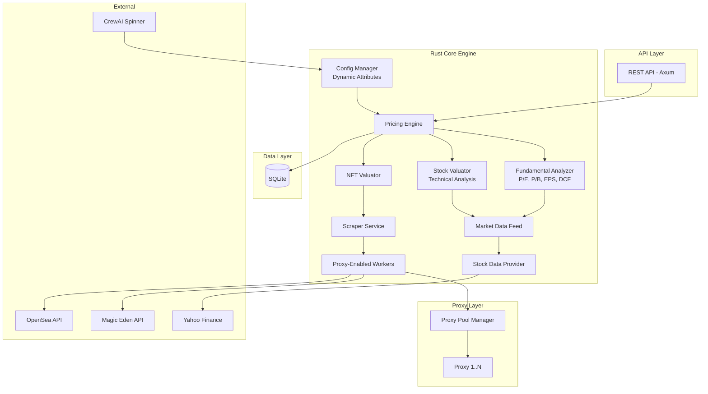

# AI Config Pricing Engine - Implementation Plan v0.2.0

## Tổng Quan

Hệ thống **Rust-based** pricing engine với khả năng:
- Cấu hình động (dynamic attributes) cho định giá NFT trên nhiều marketplace Web3
- Module phân tích **fundamental** cổ phiếu (P/E, P/B, EPS, cổ tức, DCF) + **technical** (SMA, EMA, RSI, Bollinger Bands)
- Khuyến nghị mua/bán dựa trên giá trị nội tại và biên an toàn
- Proxy pool đa luồng tránh rate-limit khi scraping
- Tích hợp CrewAI Spinner qua REST API webhook

## Kiến Trúc



## Modules

### Engine (`src/engine/`)
| File | Mô tả |
|------|--------|
| `mod.rs` | Core types: AssetType, TrendDirection, Recommendation, ValuationResult, PricingEngine trait |
| `nft_valuator.rs` | Định giá NFT: rarity score, floor price analysis, volume-weighted pricing |
| `stock_valuator.rs` | Technical analysis: SMA, EMA, RSI, Bollinger Bands, Volatility |
| `fundamental_analysis.rs` | **[NEW]** Fundamental analysis: P/E, P/B, EPS growth, DCF, khuyến nghị mua/bán |
| `scoring.rs` | AI scoring engine: weighted scoring, normalization |

### Scrapers (`src/scrapers/`)
| File | Mô tả |
|------|--------|
| `mod.rs` | MarketplaceScraper trait, RateLimitedClient (with proxy support) |
| `opensea.rs` | OpenSea API v2 integration |
| `magic_eden.rs` | Magic Eden API (Solana + multi-chain) |
| `stock_data.rs` | Yahoo Finance OHLCV + quotes |
| `proxy_pool.rs` | **[NEW]** Proxy pool: round-robin rotation, health check, failover |

### Config (`src/config/`)
| File | Mô tả |
|------|--------|
| `mod.rs` | AppConfig, DynamicConfigManager (ArcSwap hot-reload) |
| `attributes.rs` | Dynamic attributes, WeightConfig (NFT, Stock, Fundamental) |
| `marketplace_profiles.rs` | Per-marketplace profiles |

### API (`src/api/`)
| File | Mô tả |
|------|--------|
| `mod.rs` | Axum router (13 endpoints) |
| `handlers.rs` | Request handlers |
| `models.rs` | Request/Response models |

### Storage (`src/storage/`)
| File | Mô tả |
|------|--------|
| `mod.rs` | SQLite init, migrations |
| `models.rs` | ValuationRepository CRUD |

## API Endpoints

| Method | Path | Mô tả |
|--------|------|--------|
| `GET` | `/api/v1/health` | Health check |
| `GET` | `/api/v1/config` | Lấy cấu hình |
| `PUT` | `/api/v1/config` | Cập nhật cấu hình |
| `GET` | `/api/v1/config/attributes` | Lấy dynamic attributes |
| `PUT` | `/api/v1/config/attributes` | Cập nhật attributes |
| `PUT` | `/api/v1/config/weights/nft` | Cập nhật trọng số NFT |
| `PUT` | `/api/v1/config/weights/stock` | Cập nhật trọng số Stock |
| `POST` | `/api/v1/valuate/nft` | Định giá NFT |
| `POST` | `/api/v1/valuate/stock` | Phân tích cổ phiếu (technical) |
| `POST` | `/api/v1/valuate/stock/fundamental` | **[NEW]** Phân tích fundamental |
| `POST` | `/api/v1/valuate/batch` | Batch valuation |
| `GET` | `/api/v1/history/:asset_id` | Lịch sử định giá |
| `POST` | `/api/v1/crew/webhook` | CrewAI webhook |

## Verification

```bash
# Build
cargo build

# Run server
cargo run

# Test fundamental analysis
curl -X POST http://127.0.0.1:8080/api/v1/valuate/stock/fundamental \
  -H "Content-Type: application/json" \
  -d '{
    "symbol": "AAPL",
    "fundamental_data": {
      "current_price": 170,
      "eps": 6.5,
      "pe_ratio": 26.2,
      "pb_ratio": 45,
      "dividend_yield": 0.005,
      "revenue_growth": 0.08,
      "debt_to_equity": 1.8,
      "roe": 0.15,
      "free_cash_flow": 100000000000,
      "shares_outstanding": 15000000000
    }
  }'
```
